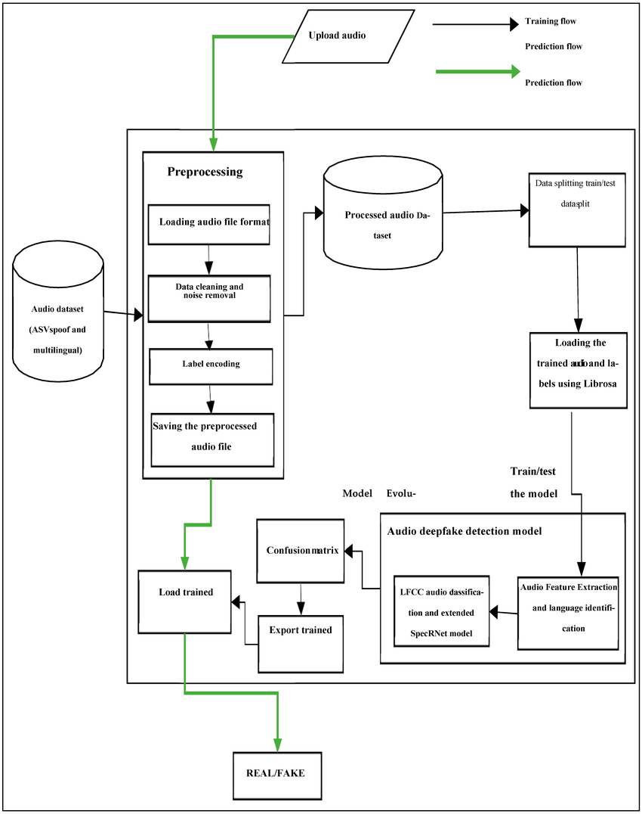

# DeepGuard


> **DeepGuard** is an AI-powered deepfake detection platform combining a fine-tuned vision model, a Retrieval-Augmented Generation (RAG) explainability engine, and forensic signal analysis to detect and explain manipulated media.

---

## Table of Contents

- [Architecture](#architecture)
- [Key Features](#key-features)
- [Tech Stack](#tech-stack)
- [Project Structure](#project-structure)
- [Prerequisites](#prerequisites)
- [Quick Start — Docker](#quick-start--docker)
- [Local Development](#local-development)
- [API Reference](#api-reference)
- [Screenshots](#screenshots)
- [Contributing](#contributing)
- [License](#license)

---

## Architecture



The system is composed of four main layers:

1. **Frontend** — React/TypeScript SPA served via Vite. Accepts image/video/audio uploads and renders detection results with Grad-CAM overlays and forensic breakdowns.
2. **Backend API** — FastAPI application exposing a v1 simple endpoint and a v2 RAG-enhanced endpoint.
3. **RAG Pipeline** — Sentence-transformer embeddings stored in ChromaDB. Similar historical cases are retrieved at inference time to enrich the explanation produced by the LLM.
4. **Forensic Analysis Engine** — Computes FFT frequency anomalies, colour-channel inconsistencies, noise-pattern irregularities, and compression artefact severity to support the model decision.

---

## Key Features

- 🔍 **RAG-Enhanced Detection** — retrieves similar past cases from a vector store to contextualise the model verdict.
- 🧪 **Forensic Signal Extraction** — FFT analysis, colour histograms, noise estimation, and JPEG compression scoring.
- 🔬 **Explainability Engine** — natural-language summaries grounded in forensic evidence and retrieved cases.
- 🗺️ **Grad-CAM Visualisations** — heatmaps highlighting the image regions that most influenced the prediction.
- ⚡ **Dual-endpoint design** — fast v1 fallback and full RAG v2 path, with automatic failover in the frontend.

---

## Tech Stack

| Layer | Technology |
|-------|-----------|
| Backend | Python 3.10, FastAPI, Uvicorn, Pydantic |
| ML / Vision | PyTorch, TorchVision, facenet-pytorch, grad-cam |
| RAG | ChromaDB, sentence-transformers |
| Forensics | OpenCV, NumPy, SciPy, librosa |
| Frontend | React 18, TypeScript, Vite |
| Task Queue | Celery + Redis (optional) |
| Containerisation | Docker, Docker Compose |

---

## Project Structure

```
DeepGuard/
├── backend/                # FastAPI application
│   ├── app/
│   │   ├── main.py         # App entry-point & route registration
│   │   ├── api/            # Route handlers (v1 & v2)
│   │   └── services/       # Detection, RAG, forensic services
│   ├── requirements.txt    # Python dependencies
│   └── Dockerfile
├── frontend/               # React/TypeScript SPA
│   ├── App.tsx
│   ├── components/
│   ├── services/
│   │   └── backendService.ts
│   ├── types.ts
│   └── Dockerfile
├── ml/                     # Model artefacts & training scripts
│   ├── checkpoints/        # Trained weights (not committed)
│   ├── datasets/           # Raw data (not committed)
│   ├── rag_index/          # ChromaDB vector index (not committed)
│   └── training/
├── notebooks/              # Jupyter exploration notebooks
├── scripts/                # Utility scripts
├── docs/                   # Additional documentation
├── docker-compose.yml
├── .env.example            # Copy to .env and fill in values
└── requirements.txt        # Thin wrapper → backend/requirements.txt
```

---

## Prerequisites

- **Docker & Docker Compose** ≥ v2 — recommended for the fastest start.
- **Python 3.10+** — for local backend development.
- **Node.js 18+** — for local frontend development.

---

## Quick Start — Docker

```bash
# 1. Clone the repository
git clone https://github.com/prathamc00/DeepGuard.git
cd DeepGuard

# 2. Copy and edit environment variables
cp .env.example .env
# Edit .env as needed

# 3. Build and start all services
docker compose up --build

# Backend:  http://localhost:8000
# Frontend: http://localhost:3000
```

---

## Local Development

### Backend

```bash
cd backend

# Create and activate a virtual environment
python -m venv .venv
source .venv/bin/activate   # Windows: .venv\Scripts\activate

# Install dependencies
pip install -r requirements.txt

# Copy and configure environment variables
cp ../.env.example ../.env

# Start the development server
uvicorn app.main:app --reload --port 8000
```

### Frontend

```bash
cd frontend

# Install dependencies
npm install

# Start the Vite dev server
VITE_API_URL=http://localhost:8000 npm run dev
# App available at http://localhost:5173
```

---

## API Reference

### v1 — Simple Detection

| Method | Path | Description |
|--------|------|-------------|
| `POST` | `/upload` | Upload a media file and receive a fake/real verdict with confidence score. |

**Request:** `multipart/form-data` with field `file`.

**Response:**
```json
{
  "result": "fake",
  "confidence": 0.93
}
```

---

### v2 — RAG-Enhanced Detection

| Method | Path | Description |
|--------|------|-------------|
| `POST` | `/api/v2/detect` | Full analysis with forensic evidence, Grad-CAM URL, and RAG-generated explanation. |
| `GET`  | `/api/v2/index/stats` | Returns statistics about the RAG vector index. |

**`POST /api/v2/detect` Response (summary):**
```json
{
  "result": "fake",
  "confidence": 0.93,
  "explanation": {
    "summary": "...",
    "confidence_reasoning": "...",
    "forensic_findings": ["..."],
    "forensic_evidence": {
      "fft_anomaly": true,
      "color_anomaly": false,
      "noise_anomaly": true,
      "compression_artifacts": "high"
    },
    "similar_cases": [],
    "gradcam_url": "/static/gradcam/abc123.png"
  }
}
```

---

## Screenshots

> _Add screenshots of the detection UI here._

---

## Contributing

1. Fork the repository and create a feature branch (`git checkout -b feat/my-feature`).
2. Commit your changes following [Conventional Commits](https://www.conventionalcommits.org/).
3. Open a pull request describing what you changed and why.
4. Ensure CI checks pass before requesting a review.

Please **never** commit secrets, model weights, or large dataset files — they are excluded by `.gitignore`.

---

## License

This project is licensed under the **MIT License**. See [LICENSE](LICENSE) for details.
